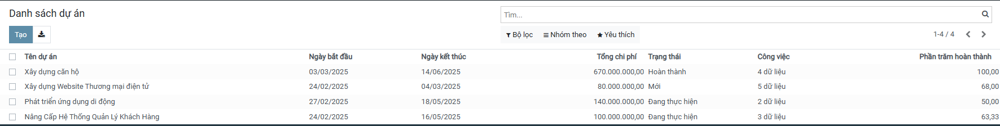
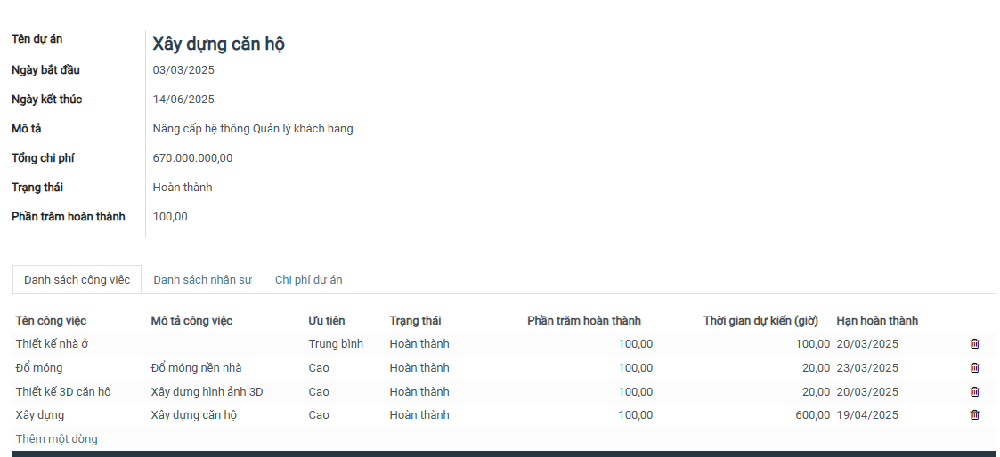
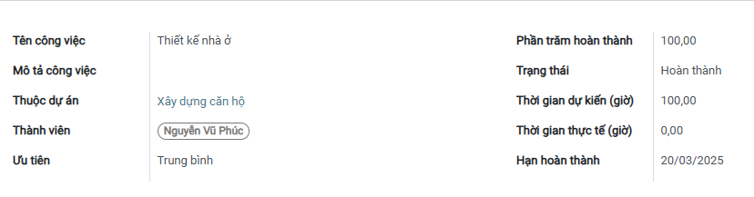
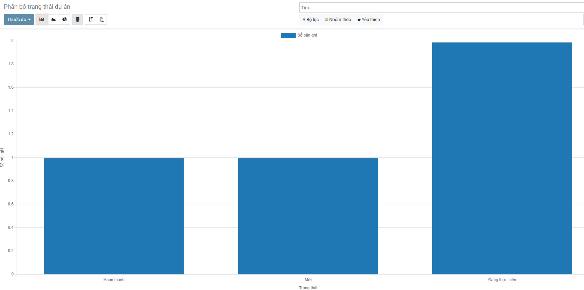
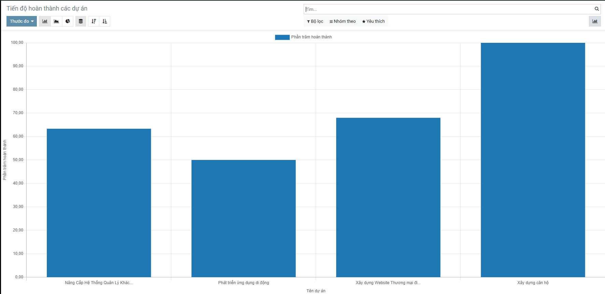
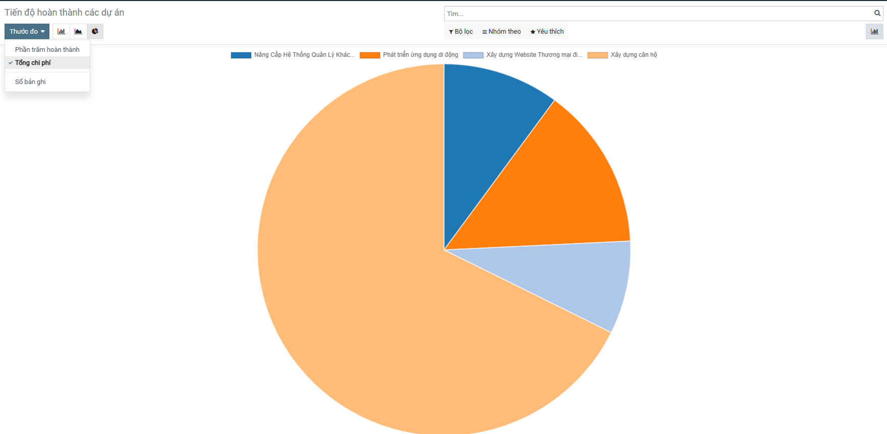

# 1. Giới thiệu về dự án Quản lý dự án
### Dự án quản lý dự án là một hệ thống hỗ trợ quản lý và theo dõi các dự án. Dưới đây là mô tả tổng quan về các chức năng chính của dự án:
1. Danh sách dự án
- Hiển thị tất cả các dự án hiện có.
- Cho phép người dùng xem thông tin chi tiết về từng dự án.
2. Phân bố trạng thái dự án
- Quản lý và theo dõi trạng thái của từng dự án (ví dụ: đang thực hiện, hoàn thành, tạm hoãn).
- Cung cấp cái nhìn tổng quan về tiến độ của các dự án.
3. Tiến độ hoàn thành các dự án
- Hiển thị tiến độ hiện tại của từng dự án.
- Ghi nhận và báo cáo về mức độ hoàn thành dự án để các bên liên quan có thể theo dõi.
4. Phân bố công việc dự án
- Chia sẻ và phân công công việc cho các thành viên trong nhóm.
- Quản lý các nhiệm vụ và đảm bảo rằng các công việc được thực hiện đúng thời hạn.
5. Tổng chi phí từng dự án
- Theo dõi chi phí phát sinh của từng dự án.
- Cung cấp báo cáo về chi phí để giúp người quản lý dễ dàng kiểm soát ngân sách dự án.
6. Báo cáo dự án
- Cung cấp các báo cáo chi tiết về tình hình dự án.
- Giúp các bên liên quan có cái nhìn tổng quan và đưa ra quyết định hợp lý.

# 2. Cài đặt công cụ, môi trường và các thư viện cần thiết

### 2.1. Clone Project
Đầu tiên, clone project từ GitHub:

  <pre>
    <code>git clone https://github.com/tungthanh1928/TTDN-15-04-N1.git</code>
  </pre>
  <button onclick="copyCode('git clone https://github.com/tungthanh1928/TTDN-15-04-N1.git')"></button>

Di chuyển vào thư mục project:

  <pre>
    <code>cd TTDN-15-04-N1</code>
  </pre>
  <button onclick="copyCode('cd TTDN-15-04-N1')"></button>

Chuyển sang nhánh cần làm việc:

  <pre>
    <code>git checkout TTDN-15-04-N1</code>
  </pre>
  <button onclick="copyCode('git checkout TTDN-15-04-N1')"></button>

### 2.2. Cài đặt các thư viện cần thiết
Người sử dụng thực thi các lệnh sau để cài đặt các thư viện cần thiết:

  <pre>
    <code>sudo apt-get install libxml2-dev libxslt-dev libldap2-dev libsasl2-dev libssl-dev python3.10-distutils python3.10-dev build-essential libssl-dev libffi-dev zlib1g-dev python3.10-venv libpq-dev</code>
  </pre>
  <button onclick="copyCode('sudo apt-get install libxml2-dev libxslt-dev libldap2-dev libsasl2-dev libssl-dev python3.10-distutils python3.10-dev build-essential libssl-dev libffi-dev zlib1g-dev python3.10-venv libpq-dev')"></button>

### 2.3. Khởi tạo môi trường ảo
Khởi tạo môi trường ảo và cài đặt các thư viện yêu cầu từ file `requirements.txt`:

  <pre>
    <code>python3.10 -m venv ./venv</code>
  </pre>
  <button onclick="copyCode('python3.10 -m venv ./venv')"></button>

Kích hoạt môi trường ảo:

  <pre>
    <code>source venv/bin/activate</code>
  </pre>
  <button onclick="copyCode('source venv/bin/activate')"></button>

Cài đặt các thư viện từ `requirements.txt`:

  <pre>
    <code>pip3 install -r requirements.txt</code>
  </pre>
  <button onclick="copyCode('pip3 install -r requirements.txt')"></button>

# 3. Setup Database
Khởi tạo database trên Docker bằng việc thực thi file `docker-compose.yml`.

Cài đặt Docker Compose:

  <pre>
    <code>sudo apt install docker-compose</code>
  </pre>
  <button onclick="copyCode('sudo apt install docker-compose')"></button>

Khởi động Docker Compose:

  <pre>
    <code>sudo docker-compose up -d</code>
  </pre>
  <button onclick="copyCode('sudo docker-compose up -d')"></button>

# 4. Setup tham số chạy cho hệ thống

### 4.1. Khởi tạo `odoo.conf`

Mở file `odoo.conf` để chỉnh sửa:

[options]
addons_path = addons
db_host = localhost
db_password = odoo
db_user = odoo
db_port = 5434
xmlrpc_port = 8069

# 5. Chạy hệ thống và cài đặt các ứng dụng cần thiết

Chạy hệ thống Odoo và cài đặt các ứng dụng:

python3 odoo-bin.py -c odoo.conf -u all

Người sử dụng truy cập theo đường dẫn http://localhost:8069/ để đăng nhập vào hệ thống.

Hoàn tất